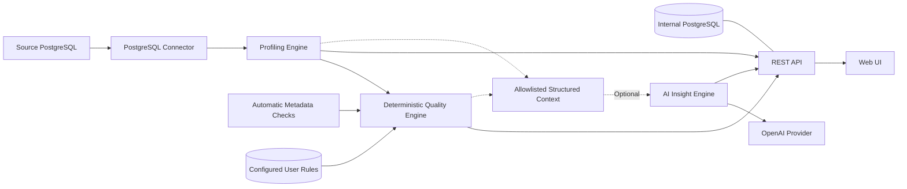

# Datuvera

**Know your data. Trust your data.**

An open-source, self-hosted, API-first data profiling and quality platform for modern data stacks. Connect PostgreSQL, explore a dataset and find quality problems with explainable scores.

## Why Datuvera?

What is in this dataset? Can I trust it? Where are the quality problems?

Datuvera helps data teams answer these questions through reproducible statistics and deterministic checks. Core profiling and quality checks do not require an LLM. Optional AI Insights interpret structured profiling and quality results without changing deterministic checks or scores.

## Features

- PostgreSQL connector, connection testing, schema and table discovery.
- Dataset profiling: row count, column count and relation size.
- Column statistics: nulls, cardinality, top values, numeric statistics, string lengths, date ranges and boolean distribution.
- Deterministic data quality checks and an explainable Quality Score.
- Web interface, REST API and an included Docker Compose demo.
- Configurable Quality Rules: create, edit, enable/disable and remove dataset rules.
- Quality History & Trends: immutable runs, historical visualization and latest-versus-previous score comparisons.
- Optional AI Insights: summary, risk, findings and suggested checks through an OpenAI provider.

## Demo

The demo database contains intentionally introduced, deterministic data quality issues. In **Sources → Add Data Source**, select **Use demo database** to fill in:

| Field | Value |
|---|---|
| Name | Datuvera Demo |
| Type | PostgreSQL |
| Host | datuvera-demo-db |
| Port | 5432 |
| Database | demo |
| Username | demo |
| Password | demo |

1. Select **Test Connection**, then **Save Source**.
2. Open the source, select `public` and find `customers`.
3. Select **Run Profile** to open Dataset Overview and Column Profiles.
4. Select **Run Quality Checks** for dimensions and issues.

`public.customers` contains 500 rows and 8 columns: 15 NULL emails, 10 invalid emails, 10 invalid states and 12 NULL lifetime values. Expected scores with the current seed: Completeness **99.33**, Uniqueness **100**, Validity **98**, overall **99.11**. The seed also includes `orders` (1,000 rows) and `products` (10 rows).

Use the service hostname above for sources accessed by the API container. For a database client on your host, the demo is at `localhost:5433`; the internal metadata database is at `localhost:5432`.

## Quick Start

Prerequisites: Git, Docker with Docker Compose v2 supporting `--wait`, and Make. Docker must be running; ports 3001, 8000, 5432 and 5433 must be available.

```bash
git clone https://github.com/jeanteixeira/datuvera.git
cd datuvera
cp .env.example .env
make up
```

The first build downloads dependencies. After startup:

- [Web UI](http://localhost:3001)
- [API health](http://localhost:8000/health)
- [API Docs](http://localhost:8000/docs)

Then follow the demo steps above. Sources are created through the API/UI; none is automatically registered.

## Architecture



- `apps/api/`: Python 3.12, FastAPI, Pydantic v2, SQLAlchemy, psycopg v3, Alembic and pytest.
- `web/`: Next.js, TypeScript, App Router and Tailwind CSS.
- `docker/`: PostgreSQL seed scripts; Compose runs internal DB, demo DB, API and web.
- `docs/`: architecture and tracked technical debt.

AI Insights is an optional interpretation layer. Profiling and Quality remain independent of the provider.

## Data Profiling

Profiling computes row/column counts, relation size, per-column null counts and percentages, distinct counts and percentages, and top values. Type-specific metrics include numeric min/max/mean, string min/max/average length, date/timestamp min/max and true/false counts. Profiling currently scans the full table; use an appropriately scoped database account.

## Data Quality

- **Completeness:** proportion of non-NULL values, averaged across column checks.
- **Uniqueness:** rows respecting primary-key and UNIQUE combinations. Composite constraints produce a single check. Ordinary PostgreSQL UNIQUE permits multiple NULLs; NULLS NOT DISTINCT is respected. All rows in a duplicate group count as affected.
- **Validity:** proportion of rows meeting applicable format, allowed-set or value-bound rules. NULLs are handled by completeness.

Current rules: `not_null`, `unique`, `email_format`, `allowed_values`, `min_value`, `max_value`. Checks return status, affected count/percentage, numerical score and a message where applicable. Missing columns make validity rules non-applicable.

Effective checks combine automatic completeness/PK/UNIQUE checks with enabled user-defined rules stored in the internal database. Identical checks are deduplicated; disabled configured rules remain listed but are not executed (they do not disable automatic checks). Manage rules in **Dataset → Quality Rules**, then rerun Quality. Parameter changes invalidate displayed Quality/AI results.

Rule creation verifies the source/table/column and basic type compatibility. Parameters are empty for not_null/unique/email_format, `{"values":["AL","PE"]}` for allowed_values, or `{"value":0}` for numeric bounds. PATCH permits only parameters and is_enabled.

**Use demo database → Save Source** explicitly creates the email_format and allowed_values rules for the new source. Existing demo sources are not changed by migration: add these two rules through Quality Rules (email/email_format; state/allowed_values: AL, PE, BA, SP, RJ). Without them, validity is not applicable. `make reset-demo` preserves configured rules and source IDs because they live in the internal database. AI suggestions are separate and never create rules automatically.

## Quality Score

```text
check_score = clamp(100 - failed_percentage, 0, 100)
dimension_score = average of applicable check scores
overall_score = average of applicable dimension scores
```

Dimensions without checks return `null` and are excluded. Overall uses equal weights and is rounded after calculation. With no applicable dimensions, the engine returns 0.

Severity is separate:

| Failures | Status |
|---|---|
| 0% | passed |
| >0% and <=5% | warning |
| >5% | failed |

**Severity does not determine the numerical score.** A check with 2% failures scores 98/warning; 10% failures scores 90/failed.

## AI Insights (optional)

AI Insights are optional. Core profiling and quality checks remain deterministic and require no LLM or API key. The fresh-clone demo works with AI disabled.

To enable OpenAI interpretation, set these values in your local `.env`:

```dotenv
DATUVERA_AI_ENABLED=true
OPENAI_API_KEY=<your key>
DATUVERA_AI_MODEL=gpt-5.4-mini
```

Run `make up` to recreate the API with the updated environment. Open a dataset and select **Generate AI Insights**. The default uses OpenAI's Responses API with Pydantic Structured Outputs; the model is configurable.

Only allowlisted metadata, percentages, numeric aggregates and deterministic issues are sent. Raw rows, row samples, `top_values`, source credentials and check messages are excluded. Schema/table/column names are included, so review whether your metadata is suitable for an external provider. Responses are requested with `store=false`.

AI returns a short summary, low/medium/high risk, up to five findings and up to five suggested checks. Suggestions are advice only: they are not executed, saved or applied automatically. Numerical Quality Scores and check statuses always come from the deterministic engine. Model recommendations still need your review.

`GET /api/v1/ai/status` reports availability without exposing a key. Missing configuration yields HTTP 503 for insights; provider failure or invalid/refused/incomplete output yields a safe HTTP 502. The UI distinguishes unavailable AI from generation failure.

For a manual real-provider test, enable the configuration above, then use the UI or:

```bash
curl -X POST http://localhost:8000/api/v1/sources/<source-id>/insights \
  -H 'Content-Type: application/json' \
  -d '{"schema":"public","table":"customers"}'
```

This explicit action sends metadata to OpenAI and consumes API tokens. The normal test suite uses fake/mock providers and never calls OpenAI.

## API

| Method | Path |
|---|---|
| GET | `/health` |
| GET | `/api/v1/info` |
| GET | `/api/v1/ai/status` |
| POST / GET | `/api/v1/sources` |
| GET | `/api/v1/sources/{id}` |
| POST | `/api/v1/sources/test` |
| POST | `/api/v1/sources/{id}/test` |
| GET | `/api/v1/sources/{id}/schemas` |
| GET | `/api/v1/sources/{id}/schemas/{schema}/tables` |
| POST | `/api/v1/sources/{id}/profile` |
| GET / POST | `/api/v1/sources/{id}/quality-rules` (optional schema/table filters for GET) |
| PATCH / DELETE | `/api/v1/sources/{id}/quality-rules/{rule_id}` |
| POST | `/api/v1/sources/{id}/quality` |
| POST | `/api/v1/sources/{id}/insights` |

Profile and quality requests use `{"schema": "public", "table": "customers"}`. Source responses omit passwords. Full request/response documentation: [Swagger UI](http://localhost:8000/docs).

## Development

| Command | Purpose |
|---|---|
| `make help` | List commands |
| `make up` | Build and start all services; wait for readiness |
| `make down` | Stop/remove containers while keeping database volumes |
| `make build` | Build API and web images |
| `make logs` | Follow service logs |
| `make test` | Start both databases and run backend tests in an updated API image |
| `make reset-demo` | Replace only the demo public schema and reload the seed |
| `make shell` | Open an API shell |

Tests create temporary test objects and source records in the local metadata database; use a development environment.

### Data persistence and existing installations

New environments use explicit named volumes `datuvera_db_data` (metadata) and `datuvera_demo_db_data` (demo). `make down` preserves them. `make reset-demo` keeps both volumes: it drops/recreates only the demo database's `public` schema and reloads the seed in one transaction. Custom objects in that schema are deleted; saved source registrations in the internal database remain.

Older installations used anonymous volumes. **Before starting the updated Compose configuration**, record their names:

```bash
docker inspect $(docker compose ps -a -q datuvera-db) --format '{{range .Mounts}}{{if eq .Destination "/var/lib/postgresql/data"}}{{.Name}}{{end}}{{end}}'
docker inspect $(docker compose ps -a -q datuvera-demo-db) --format '{{range .Mounts}}{{if eq .Destination "/var/lib/postgresql/data"}}{{.Name}}{{end}}{{end}}'
```

Add the two actual names to your existing `.env`:

```dotenv
DATUVERA_DB_VOLUME=<existing internal volume name>
DATUVERA_DEMO_DB_VOLUME=<existing demo volume name>
DATUVERA_EXTERNAL_VOLUMES=true
```

This adopts the existing volumes without copying or deleting data. Both volumes must already exist. Do not overwrite that `.env` with the example afterward. Without these overrides, Compose uses the new named volumes; old volumes are not automatically migrated or deleted. For stopped/removed containers, inspect your existing Docker volumes/backups before choosing names.

The example credentials are for local use only. `API_URL` is the web server's API destination and is baked into rewrites during build; rebuild web after changing it. Outside Docker, set it to `http://localhost:8000`.

## Roadmap

- [x] PostgreSQL connector
- [x] Dataset discovery
- [x] Profiling Engine
- [x] Quality Engine
- [x] Optional AI Insights
- [ ] CSV / Parquet
- [ ] S3 / MinIO
- [ ] Additional connectors
- [ ] Historical quality runs
- [ ] Observability / alerts

## Contributing

Small, focused contributions are welcome. See [CONTRIBUTING.md](CONTRIBUTING.md) for setup, validation and pull requests, and [technical debt](docs/technical-debt.md) for known limitations.

## License

[MIT](LICENSE).

### Product workspace

The application opens on Overview with real source and configured-rule counts. Use Data Sources to connect PostgreSQL or load the demo preset, then select a schema and table. Dataset tabs organize Overview, Columns, Quality (rules and checks), and optional AI Insights. Profile and quality runs are explicit actions; results remain in the current dataset workspace and quality runs are persisted as immutable snapshots. Datasets, Quality and AI Insights navigation pages help you choose a source without scanning every connected database.

### Quality History & Trends

Every successful manual Quality execution persists its scores and checks in the internal PostgreSQL database before returning the existing QualityResult response. Snapshots remain unchanged when rules or demo data change. The Quality tab lists recent runs and opens historical checks inline. GET `/api/v1/sources/{id}/quality-runs?schema=public&table=customers&limit=20&offset=0` lists summaries (maximum limit 100); `/{run_id}` and `/latest?schema=public&table=customers` return complete snapshots. History shows one metric at a time on a fixed 0–100 chart, with Last 10/20/50 runs and score-point changes. Alerts and scheduling are not available. AI Insights still analyzes the current result and does not create quality runs.

Frontend history helper, chart-contract and refresh tests run with `npm test` from `web/`.
