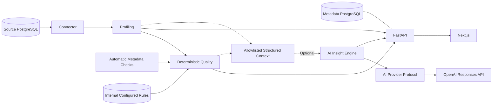
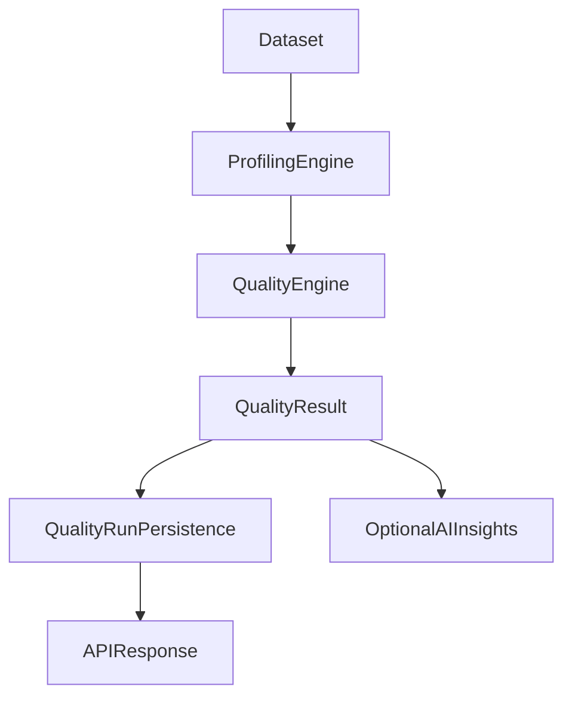

# Architecture

Datuvera is a monorepo with a FastAPI backend (`apps/api`) and a Next.js frontend (`web`). Docker Compose runs the API, web, internal PostgreSQL metadata database and a seeded PostgreSQL demo database.

The API stores source registrations in the internal database. PostgreSQL discovery and profiling access the registered source; profiling produces dataset and column metrics. The deterministic Quality Engine consumes these metrics and runs applicable SQL checks. The web calls the REST API through Next.js rewrites.

Backend modules: `api/v1`, `core`, `db`, `models`, `schemas`, `services/connectors`, `profiling` and `quality`. Alembic manages metadata schema migrations. Core profiling and quality do not use AI. Optional `ai/` contains the context builder, explicit Pydantic models, interpretation engine and provider adapters.

The insights endpoint loads the source and reuses the existing profiling/quality engines. It passes their results through an explicit allowlist to the AI engine. The AI engine has no database access and depends only on the `AIProvider.generate_insights(context)` protocol. SDK calls are isolated in `ai/providers/openai.py`.

The context excludes raw rows, samples, top values, credentials and check messages. Numeric aggregates are included only for numeric columns; text/date extrema are excluded. Structured output uses controlled risk/severity/rule values with at most five findings/suggestions. No score calculation, SQL execution or rule persistence is performed by the AI layer.

AI defaults to disabled. Missing configuration does not initialize an SDK client or block startup/core endpoints. Status exposes only availability/provider/model; safe HTTP 503 and 502 distinguish unconfigured AI from provider failure. OpenAI clients have a 30-second timeout, no automatic retries and `store=false`. No real provider calls occur in tests.

New environments use separate named volumes for metadata and demo. Existing volumes can be adopted explicitly through `.env`; see the README. Demo reset replaces only the demo public schema, leaving both volumes and internal metadata intact.

DatasetQualityRule stores source_id, schema_name, table_name, column_name, rule_type, JSONB parameters, enabled state and timestamps in the internal database. No persisted Dataset entity is introduced. A source FK cascades on database deletion; there is currently no source DELETE API.

Quality and Insights load enabled rules via QualityRuleService. The engine merges them with existing per-column completeness and PK/UNIQUE checks, deduplicating by type/column tuple and validity parameters. Configured single-column UNIQUE uses normal PostgreSQL NULL semantics; automatic composite checks are preserved. Demo configuration is created explicitly by the source form, not the engine or migration. Resetting the demo public schema does not touch internal rule records.

AI context remains an allowlist of result metadata and aggregated issues; configured parameters are not sent to the provider. Suggestions are not persisted or executed.

## Quality run persistence

Manual Quality requests calculate QualityResult in the independent deterministic engine, then QualityRunService commits an immutable snapshot before the API returns the unchanged result. Failed calculations create no run; database commit failures return a safe error and roll back. QualityRun stores scores (nullable dimensions), the existing checks JSON structure and a timezone-aware creation timestamp, associated with source/schema/table. Source deletion cascades; demo reset leaves internal rules and history intact. Dataset history uses indexed database ordering and LIMIT/OFFSET. AI Insights continues using a freshly calculated current QualityResult without creating or reading historical runs.

## History and trends

QualityRun summaries → existing paginated History Query → frontend comparison and trends → Web UI. No migration or trend engine is required. Summary queries defer checks JSONB; full snapshots are fetched only when opened. The frontend compares latest and previous scores in absolute points, preserves nullable dimensions and reverses newest-first summaries for chronological visualization. History does not classify incidents or infer causes.
