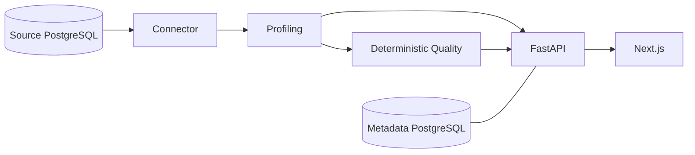

# Architecture

Datuvera is a monorepo with a FastAPI backend (`apps/api`) and a Next.js frontend (`web`). Docker Compose runs the API, web, internal PostgreSQL metadata database and a seeded PostgreSQL demo database.

The API stores source registrations in the internal database. PostgreSQL discovery and profiling access the registered source; profiling produces dataset and column metrics. The deterministic Quality Engine consumes these metrics and runs applicable SQL checks. The web calls the REST API through Next.js rewrites.

Backend modules: `api/v1`, `core`, `db`, `models`, `schemas`, `services/connectors`, `profiling` and `quality`. Alembic manages metadata schema migrations. Core profiling and quality do not use AI; AI Insights are planned.

New environments use separate named volumes for metadata and demo. Existing volumes can be adopted explicitly through `.env`; see the README. Demo reset replaces only the demo public schema, leaving both volumes and internal metadata intact.
