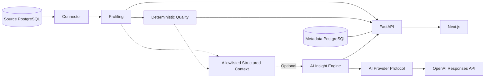

# Architecture

Datuvera is a monorepo with a FastAPI backend (`apps/api`) and a Next.js frontend (`web`). Docker Compose runs the API, web, internal PostgreSQL metadata database and a seeded PostgreSQL demo database.

The API stores source registrations in the internal database. PostgreSQL discovery and profiling access the registered source; profiling produces dataset and column metrics. The deterministic Quality Engine consumes these metrics and runs applicable SQL checks. The web calls the REST API through Next.js rewrites.

Backend modules: `api/v1`, `core`, `db`, `models`, `schemas`, `services/connectors`, `profiling` and `quality`. Alembic manages metadata schema migrations. Core profiling and quality do not use AI. Optional `ai/` contains the context builder, explicit Pydantic models, interpretation engine and provider adapters.

The insights endpoint loads the source and reuses the existing profiling/quality engines. It passes their results through an explicit allowlist to the AI engine. The AI engine has no database access and depends only on the `AIProvider.generate_insights(context)` protocol. SDK calls are isolated in `ai/providers/openai.py`.

The context excludes raw rows, samples, top values, credentials and check messages. Numeric aggregates are included only for numeric columns; text/date extrema are excluded. Structured output uses controlled risk/severity/rule values with at most five findings/suggestions. No score calculation, SQL execution or rule persistence is performed by the AI layer.

AI defaults to disabled. Missing configuration does not initialize an SDK client or block startup/core endpoints. Status exposes only availability/provider/model; safe HTTP 503 and 502 distinguish unconfigured AI from provider failure. OpenAI clients have a 30-second timeout, no automatic retries and `store=false`. No real provider calls occur in tests.

New environments use separate named volumes for metadata and demo. Existing volumes can be adopted explicitly through `.env`; see the README. Demo reset replaces only the demo public schema, leaving both volumes and internal metadata intact.
